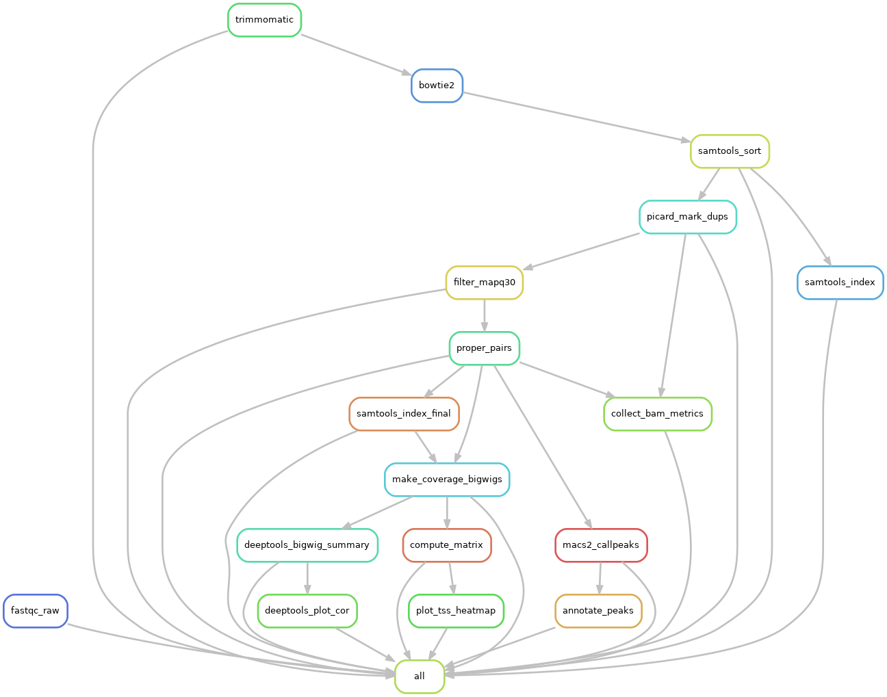

# ChIP-Seq snakemake pipeline

Pipeline for processing ChIP-Seq data.

## How to use
### 1. Prepare work environment

- Clone this repository in the working directory

```
git clone https://github.com/luostrowski/chipseq_snakemake.git
```

- Navigate into the data/fastq directory

```
cd data/fastq
```

- Symlink files to the directory

```
ln -s /absolute/path/to/file_R1.fq.gz .
ln -s /absolute/path/to/file_R2.fq.gz .
```

- Rename symlink to proper format

```
mv file_R1.fq.gz sample_R1.fastq.gz
mv file_R2.fq.gz sample_R2.fastq.gz
```

### 2. Prepare conda environment

- Create a new conda environment with snakemake installed. You will need to have previously installed anaconda or miniconda. If you are using `mamba`, you can replace conda by mamba in all the steps

```
conda create -c conda-forge -c bioconda -n snakemake snakemake
```

- Activate the environment

```
conda activate snakemake
```

### 3. Adjust configuration file

The `proj_config.yaml` file contains the wildcards that the script will use. 

- Change the path to the reference genome (it must be indexed).

- Change the path to the gtf file. 

- Adjust treat samples if necessary.

### 4. Execute the snakefile

- First try a dry run to make sure the structure works.

```
snakemake --dry-run
```

- Adjust the `cluster.json` file to run on a cluster submitting slurm jobs.

    - The `--latency-wait 60` parameter is required when using slurm to make sure outfiles are complete.

```
snakemake --use-conda --jobs 100 --latency-wait 60 --cluster-config cluster.json --cluster "sbatch --qos {cluster.qos} -p {cluster.partition} -N {cluster.nodes} -n {cluster.cores} --mem {cluster.mem} -t {cluster.time} -o {cluster.stdout} -e {cluster.stderr}"
```

- If it is necessary to re-run the script, the incomplete files will need to be re-generated. 

```
snakemake --rerun-incomplete --use-conda --jobs 100 --latency-wait 60 --cluster-config cluster.json --cluster "sbatch --qos {cluster.qos} -p {cluster.partition} -N {cluster.nodes} -n {cluster.cores} --mem {cluster.mem} -t {cluster.time} -o {cluster.stdout} -e {cluster.stderr}"
```

## Directed acyclic graph of the steps

